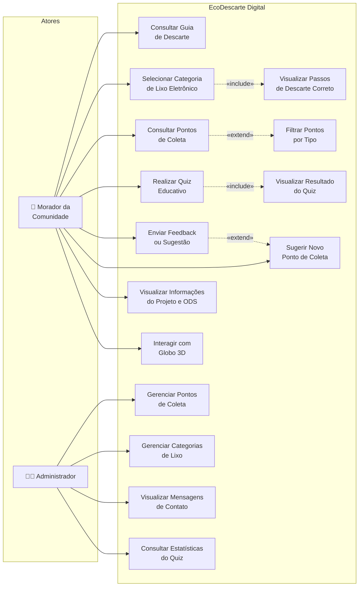
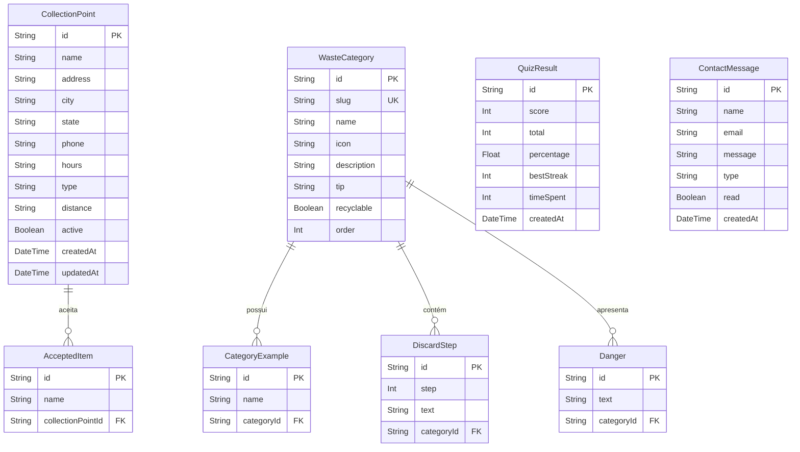
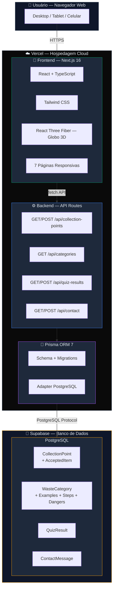

# Diagramas Mermaid — EcoDescarte Digital

Acesse https://mermaid.live e cole cada código abaixo.
Depois clique no botão de download (PNG) para salvar a imagem.

---

## DIAGRAMA 1 — Casos de Uso



---

## DIAGRAMA 2 — Entidade-Relacionamento (Banco de Dados)



---

## DIAGRAMA 3 — Fluxo da Metodologia (AE I — Levantamento)

```mermaid
flowchart TD
    A([🚀 Início]) --> B

    B["1. Levantamento do Problema\n━━━━━━━━━━━━━━━━━━━━\nPesquisa informal com moradores\ndo bairro Novo Retiro sobre\ndescarte de lixo eletrônico"]

    B --> C["2. Pesquisa de Soluções\n━━━━━━━━━━━━━━━━━━━━\nAnálise de alternativas tecnológicas\nEscolha: plataforma web responsiva\nacessível via navegador"]

    C --> D["3. Definição da Arquitetura\n━━━━━━━━━━━━━━━━━━━━\nNext.js 16 + TypeScript + Tailwind CSS\nPostgreSQL + Prisma ORM 7\nVercel para hospedagem"]

    D --> E["4. Modelagem do Banco de Dados\n━━━━━━━━━━━━━━━━━━━━\n8 entidades relacionais\nSchema Prisma + migrations\nSupabase como provedor"]

    E --> F["5. Prototipação das Interfaces\n━━━━━━━━━━━━━━━━━━━━\n7 páginas responsivas\nAplicação dos 7 Princípios\ndo Desenho Universal"]

    F --> G["6. Catalogação dos Pontos de Coleta\n━━━━━━━━━━━━━━━━━━━━\n8 pontos em Esmeraldas/MG e região\nÓrgãos públicos, lojas, cooperativas\ne programas nacionais"]

    G --> H["7. Elaboração do Conteúdo Educativo\n━━━━━━━━━━━━━━━━━━━━\n6 categorias de lixo eletrônico\n15 perguntas para quiz educativo\nBaseado na Lei 12.305/2010"]

    H --> I([✅ Levantamento Concluído])

    style A fill:#059669,stroke:#047857,color:#fff
    style I fill:#059669,stroke:#047857,color:#fff
    style B fill:#1e293b,stroke:#334155,color:#e2e8f0
    style C fill:#1e293b,stroke:#334155,color:#e2e8f0
    style D fill:#1e293b,stroke:#334155,color:#e2e8f0
    style E fill:#1e293b,stroke:#334155,color:#e2e8f0
    style F fill:#1e293b,stroke:#334155,color:#e2e8f0
    style G fill:#1e293b,stroke:#334155,color:#e2e8f0
    style H fill:#1e293b,stroke:#334155,color:#e2e8f0
```



---

## DIAGRAMA 4 — Fluxo da Metodologia (AE II — Projeto/Implementação)

```mermaid
flowchart TD
    A([🚀 Início]) --> B

    B["1. Configuração do Ambiente\n━━━━━━━━━━━━━━━━━━━━\nNode.js 22 + Next.js 16\nTypeScript 5 + Tailwind CSS 3\nGit + GitHub"]

    B --> C["2. Implementação do Banco de Dados\n━━━━━━━━━━━━━━━━━━━━\nPostgreSQL no Supabase\nPrisma ORM 7 + Migrations\nScript de seed com dados iniciais"]

    C --> D["3. Desenvolvimento das API Routes\n━━━━━━━━━━━━━━━━━━━━\n4 endpoints RESTful:\n/api/collection-points\n/api/categories\n/api/quiz-results\n/api/contact"]

    D --> E["4. Desenvolvimento do Frontend\n━━━━━━━━━━━━━━━━━━━━\n7 páginas responsivas\nGlobo 3D com React Three Fiber\nQuiz gamificado + Formulário de contato"]

    E --> F["5. Testes e Validação\n━━━━━━━━━━━━━━━━━━━━\nTestes em desktop, tablet e celular\nNavegadores: Chrome, Firefox, Edge\nValidação de acessibilidade"]

    F --> G["6. Deploy na Vercel\n━━━━━━━━━━━━━━━━━━━━\nDeploy contínuo via GitHub\nConfiguração de variáveis de ambiente\nURL pública acessível"]

    G --> H["7. Aplicação na Comunidade\n━━━━━━━━━━━━━━━━━━━━\nDivulgação no bairro Novo Retiro\nCompartilhamento via WhatsApp\nColeta de feedback dos moradores"]

    H --> I([✅ Projeto Implementado\ne Aplicado na Comunidade])

    style A fill:#059669,stroke:#047857,color:#fff
    style I fill:#059669,stroke:#047857,color:#fff
    style B fill:#1e293b,stroke:#334155,color:#e2e8f0
    style C fill:#1e293b,stroke:#334155,color:#e2e8f0
    style D fill:#1e293b,stroke:#334155,color:#e2e8f0
    style E fill:#1e293b,stroke:#334155,color:#e2e8f0
    style F fill:#1e293b,stroke:#334155,color:#e2e8f0
    style G fill:#1e293b,stroke:#334155,color:#e2e8f0
    style H fill:#1e293b,stroke:#334155,color:#e2e8f0
```



---

## DIAGRAMA 5 — Arquitetura do Sistema



---

## COMO USAR

1. Acesse https://mermaid.live
2. Apague o código de exemplo que aparece
3. Cole o código de UM diagrama por vez (só o que está entre os ```mermaid```)
4. O diagrama aparece automaticamente à direita
5. Clique no ícone de download (PNG) no canto superior direito
6. Salve a imagem
7. Cole no documento Word da Uninter com legenda:
   - "Figura 1 — Diagrama de Casos de Uso do Sistema EcoDescarte Digital"
   - "Figura 2 — Diagrama Entidade-Relacionamento do Banco de Dados"
   - "Figura 3 — Diagrama de Fluxo da Metodologia (Levantamento)"
   - "Figura 4 — Diagrama de Fluxo da Metodologia (Implementação)"
   - "Figura 5 — Diagrama de Arquitetura do Sistema"
